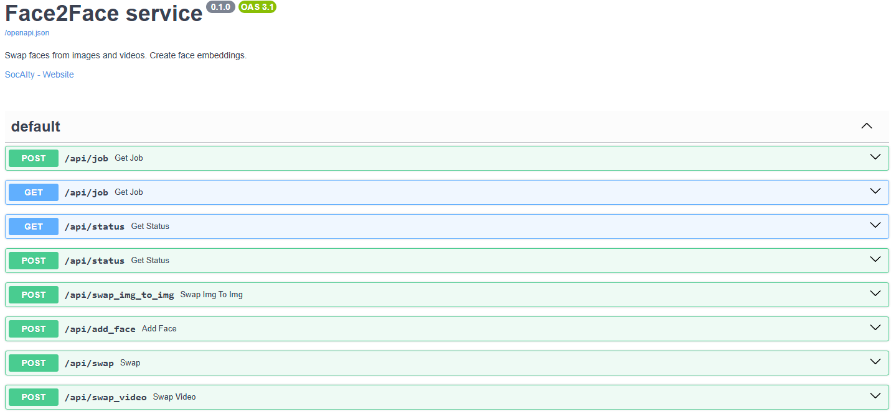

# Web Service



## Starting the Web Service

If not yet installed use `pip install socaity-face2face[full]` to install the module.

Start the server by running the provided .bat file "start_server.bat" 
by using `python -m face2face.server` make sure the python PYTHONPATH is set to the root of this repository.


Note: The first time you start the server, it will download the models. This can take a while.
If this fails, you can download the files manually and store them in models/ or models/insightface/inswapper_128.onnx

The Webservice is built with [FastTaskAPI](https://github.com/SocAIty/FastTaskAPI). 
In this regard, for each request it will create a task and return a job id.
You can then check the status of the job and retrieve the result.


## Usage

The webservice provides enpdoints for the swap, add_face and enhance_face functionality.
You can send requests to the endpoints with any http client, e.g. requests, httpx, curl, etc.
However, we recommend using the [fastSDK](https://github.com/SocAIty/fastSDK).

### With fastSDK

FastSDK is a python module that provides a convenient way to interact with the webservice.


### With plain web requests
### Send requests

First encode the image as bytes.
```python
# load images from disc
with open("myimage.jpg", "rb") as image:
    my_image = image.read()
```
Then send a post request to the endpoint.
```python
job2 = requests.post("http://localhost:8020/api/add_face", files={"media": my_image, "faces": "biden"})
```

### Parse the results

The response is a json that includes the job id and meta information.
By sending then a request to the job endpoint you can check the status and progress of the job.
If the job is finished, you will get the result, including the swapped image.
```python
import cv2
from io import BytesIO
# check status of job
response = requests.get(f"http://localhost:8020/api/job/{job.json()['job_id']}")
# convert result to image file
swapped = cv2.imread(BytesIO(response.json()['result']))
```
